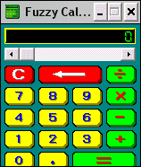

# Fuzzy Calculator

It is a traditional calculator with the exception that its operations are implemented as fuzzy operations 
with the numbers from the interval [0,1]. 

## Author

Alexandr Savinov 
* http://conceptoriented.org/savinov
* https://www.researchgate.net/profile/Alexandr_Savinov
